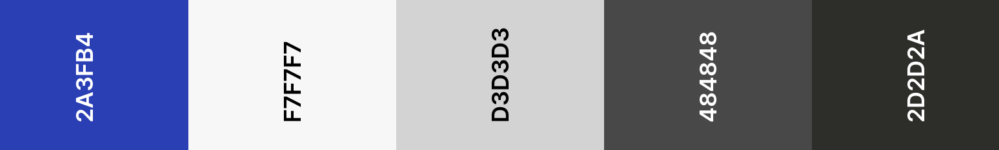

<div align="center">
    
    <br/>
    <b>Kolab Frontend Documentation</b>
    <br/>
    
    
    
</div>
<br>
<a href="https://kolab17.azurewebsites.net">Click here</a> to view the live deployment of the application.

#### Table of Contents
1. [Project Brief](#project-brief)
2. [Design Decisions](#design-decisions)
    - [Color Palette](#color-palette)
3. [Usage](#usage)
4. [Quick Links](#quick-links)
5. [License](#licence)

## Project Brief
Kolab is a collaboration platform for students where they can anonymously ask questions to their peers. It follows a forum based approach as one is able to post, and also leave followups.

The application is powered by React in the frontend, Node.js in the backend, and MySQL database is used to store everything relating to the forum data.

On a platform where you can maintain anonymity, good security is essential. Therefore, students must use Google authorization to gain access into their portal.

## Design Decisions
### Color Palette
The ultimate focus on the first day of development was to choose the correct colors, as this would be an excellent start to start creating assets for our application.

The primary color for the whole appliction was chosen to be Blue, as it represents confidence and intelligence of the students. One of the other consideration was Orange, but it wasn't used because there wasn't enough contrast against White.

Lots of variations of Gray are used across components throughout the application to promote the sense of simplicity. This plainness of the interface would ensure that there is no visual disturbance for students.

Below are the most commonly used colors through out the application.

<div align="center">
    
</div>

## Usage
Clone this repository in the directory of your choice, and then run `npm install` to install all its dependencies. 

This application uses the *Google OAuth2* authentication, and hence you will need to generate a client identifier from <a href="https://console.developers.google.com/">here</a>. To store this, create an `.env` file within the root of your React project directory with the following structure.

```
REACT_APP_CLIENT_ID=<insert your identifiier here>
```

Once this process is completed, you can run `npm start` to start the application. You will then be able to access it on `localhost:3000`.

## Quick Links
- <a href="https://www.typescriptlang.org/docs/handbook/react.html">Handbook - React - Typescript</a>
- <a href="https://reactjs.org/">React Documentation</a>
- <a href="https://www.npmjs.com/package/react-google-login">react-google-login</a>

## Licence
> You can check out the full licence <a href="./LICENSE">here</a>.

This project is licensed under the terms of the MIT Licence.